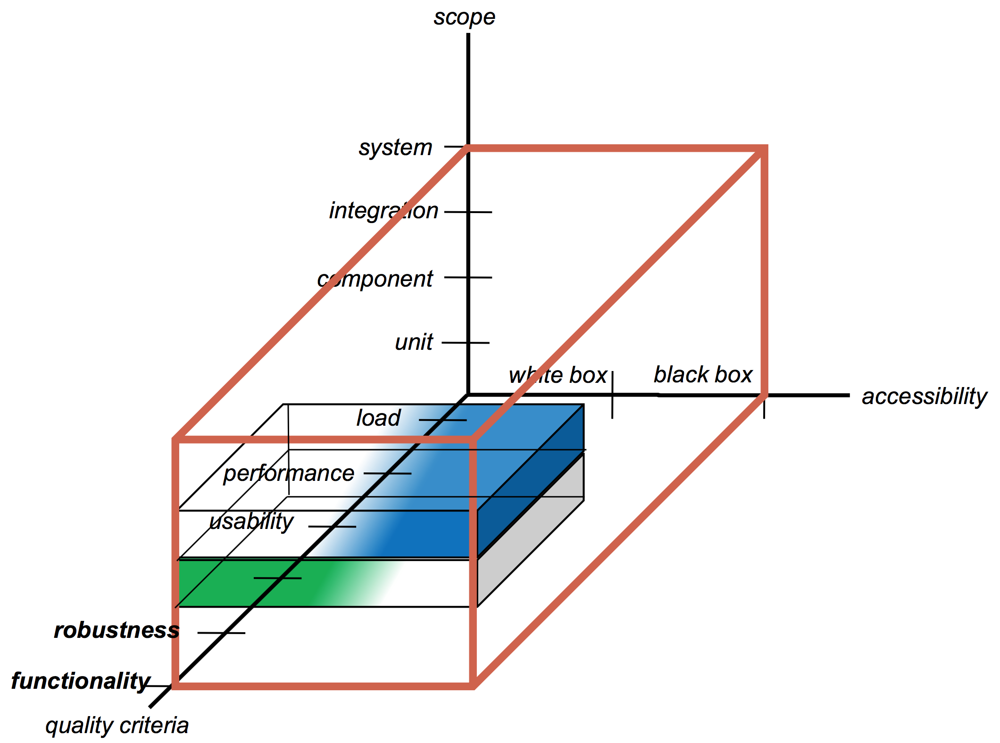
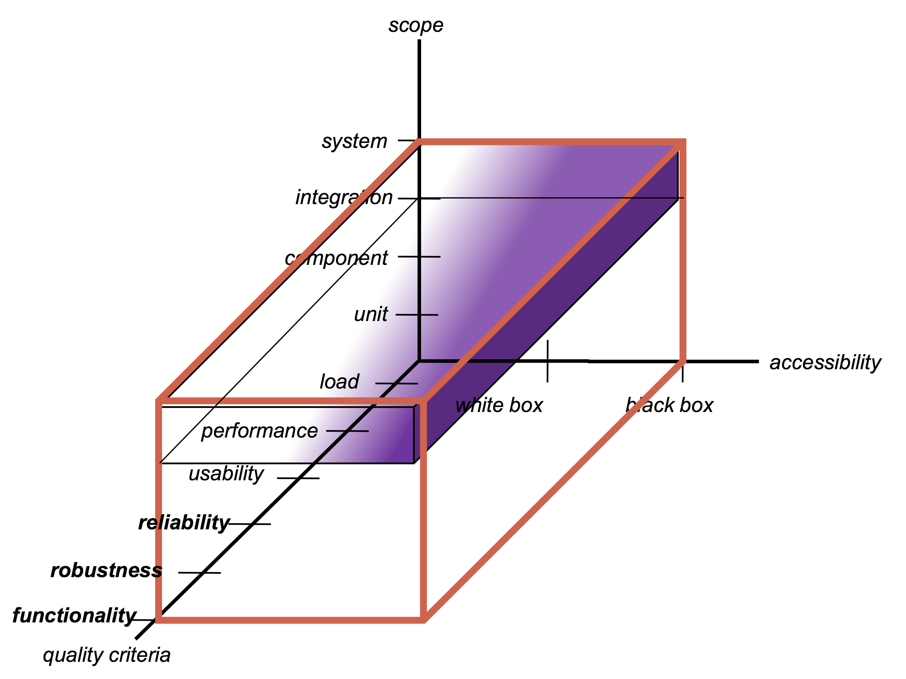

# Software Quality
- explicitly stated functional and performance
requirements,
- explicitly documented development standards,
- implicit characteristics that are expected of all professionally developed software.

## Problems with Software Quality

- Software specifications are usually incomplete and often inconsistent
- There is tension between:
	- customer quality requirements (efficiency, reliability, etc.)
	- developer quality requirements (maintainability, reusability, etc.)
- Some quality requirements are hard to specify in an unambiguous way
	- directly measurable qualities (e.g., errors/KLOC),
	- indirectly measurable qualities (e.g., usability).

__Quality management is not just about reducing defects!__

## Quality Management Activities
- Quality assurance
 - establishing organizational quality standards and procedures
- Quality planning
 - selecting and modifying applicable quality standards and
procedures for a particular project
- Quality control
 - ensuring quality standards and procedures are followed by development team

## Quality Attributes
__Quality attributes apply to the product, the project and the process.__
- product: delivered to the customer
- process: produces the software product
- project: applies the process over a fixed period to develop the product
- resources: (the product, the project and the process require resources)
	- Underlying assumption: a quality process leads to a quality product (cf. metaphor of manufacturing lines)

__Quality attributes can be external or internal.__
- External: Derived from the relationship between the environment and the system (or the process). (To derive, the system or process must run)
	- e.g. Reliability, Robustness
- Internal: Derived immediately from the product or process description
(To derive, it is sufficient to have the description)
	- Underlying assumption: internal quality leads to external quality (cfr. metaphor manufacturing lines)
	- e.g. Efficiency

__Correctness__
- A system is correct if it behaves according to its specification  An absolute property (i.e., a system cannot be “almost correct”)  ... in theory and practice undecidable

__Reliability__
> Reliability is the ability of a system to remain operational over time.
> Reliability is measured as the probability that a system will not fail to perform its intended functions over a specified time interval.

- The user may rely on the system behaving properly
- Reliability is the probability that the system will operate as expected over a
specified interval
	- A relative property (a system has a mean time between failure of 3 weeks)

__Robustness__
- A system is robust if it behaves reasonably even in circumstances that were not specified
- A vague property (once you specify the abnormal circumstances they become part of the requirements)

__Efficiency (Performance)__
- Use of resources such as computing time, memory
	- Affects user-friendliness and scalability
	- Hardware technology changes fast!
	- First do it, then do it right, then do it fast
- For process, resources are manpower, time and money
	- relates to the “productivity” of a process

__Usability (User Friendliness, Human Factors)__
- The degree to which the human users find the system (process) both
“easy to use” and useful
	- Depends a lot on the target audience (e.g., novices vs. experts)
	- Often a system has various kinds of users (end-users, operators,
administrators)
	- Often expressed in “amount of time to learn the system”

__Maintainability__
- How easy it is to change a system after its initial
release
	- software entropy
	- maintainability gradually decreases over time

	__*Repairability*__
	- How much work is needed to correct a defect

	__*Evolvability (Adaptability)*__
	- How much work is needed to adapt to changing requirements (both system and process)

	__*Portability*__
	- How much work is needed to port to new environment or platforms

__Verifiability__
- How easy it is to verify whether desired attributes are there?
	- internally: e.g., verify requirements, code inspections
	- externally: e.g., testing, efficiency(Lastentest)

__Understandability__
- How easy it is to understand the system
	- internally: contributes to maintainability
	- externally: contributes to usability

__Timeliness__
- Ability to deliver the product on time
	- important for marketing (“short time to market”)
	- often a reason to sacrifice other quality attributes
	- incremental development may provide an answer

__Visibility (Transparency)__
- Current process steps and project status are accessible
	- important for management
	- also deal with staff turn-over

## Quality Standards

> Product standards define characteristics that all components should exhibit.
> Process standards define how the software process should be enacted.

| Product standards | Process standards |
| ----------------- | ----------------- |
| Design review form 				| Design review conduct |
| Document naming standards | Submission of documents |
| Procedure header format 	| Version release process |
| Java conventions 					| Project plan approval process |
| Project plan format 			| Change control process |
| Change request form 			| Test recording process |

__Potential Problems with Standards__
- Not always seen as relevant and up-to-date by software engineers
- May involve too much bureaucratic form filling
- May require tedious manual work if unsupported by software tools
	- Limit overhead to effectively apply standards

## Quality Plan
- Identifies the most significant quality attributes appropriate for the product
- Defines the assessment process in detail for each quality attribute
- Indicates which organization standards should be applied and defines new standards as necessary

## Document Standards
- Document identification standards
	- how documents are labeled
- Document structure standards
	- organization of project documents
- Document presentation standards
	- fonts, styles, logos, etc.
- Document update standards
	- change control and version definition

## Software Quality Verification and Validation
__Verification__
 - Are we building the product right?
 - Performed at the end of each phase* to
ensure that requirements established during previous phases have been met

__Validation__
 - Are we building the right product?
 - Performed at the end of development
cycle * to ensure that the product does what it is supposed to do

## Quality Controls
Ensures that the defined quality standards are met.

## Typical Control Activities of an SQA Process

## Types of Software Quality Controls
1. Static Controls
	— Inspections for defect removal (product)
	— Progress Assessment Reviews (product and process)
	— Quality reviews (product and standards)
	— Manual Tests
2. Dynamic and Automated Controls
	— Automated tests
	— Measure software attributes and compare to standards (e.g., defect rate, cohesion, tests, coverage, style, etc.)

## Product Measurement Process
1. Choose measurement to be made
2. Select components to be assessed
3. Measure component characteristics
4. Identify anomalous measurements
5. Analyze anomalous components

## Quality process
The steps to design your quality process:
1. Chooseyoursoftwareprocess
2. Determine the quality attributes of your product, project and process
3. Determine the quality controls (when and how) for your project
4. Document the quality process in the quality plan

## Quality Control Tools
- Testing
	- automated and manual
- Continuous integration and deployment
- SW Design and Code analysis
- Process analysis
- Requirements validation
- Review
- Retrospectives
- User Demos
- Measurement tools

## Quality Plan
Components
- Product introduction
- Product plans
- Process descriptions
- Quality goals
- Risks and risk management

# Code Review
Code review is systematic examination (often known as peer review) of computer source code. It is intended to find and fix mistakes overlooked in the initial development phase, improving both the overall quality of software and the developers’ skills.

## The main goals of code review are:
- To spot and fix defects early in the process.
- Better-shared understanding of the code base as team members learn from each other
- Helps to maintain a level of consistency in design and implementation.
- Helps to identify common defects across the team thus reducing rework.
- Builds confidence of stakeholders about technical quality of the execution.
- Uniformity in understanding will help interchangeability of team members in case of non-availability of any one of them.
- A different perspective. “Another set of eyes” adds objectivity. Similar to the reason for separating your coding and testing teams, peer reviews provide the distance needed to recognize problems.
- Pride/reward. Recognition of coding prowess is a significant reward for many programmers.
- Team cohesiveness. Working together helps draw team members closer. It also provides a brief respite from the isolation that coding often brings.

## The main areas a reviewer is focusing on are as follows:
- General Unit Testing
- Comment and Coding Conventions
- Error Handling
- Resource Leaks
- Thread Safety
- Control Structures
- Performance
- Functionality
- Security

## Assign Severity to Review Finding
> The severity to find issues with code should go as below. Reviewer must focus on issues with High severity first and then to Medium severity and then Low severity issues.

- Naming Conventions and Coding style = Low
- Control Structures and Logical issues = Medium or High
- Redundant Code = High
- Performance Issues =High
- Security Issues = High
- Scalability Issues= High
- Functional Issues =High
- Error Handling = High
- Reusability = Medium

## Five types of review

### Formal inspections

### Over-the-shoulder reviews

### E-mail pass-around reviews

### Tool-Assisted reviews
- TODO

### Pair-Programming
- TODO

# Integration Testing
## Unit Testing
- isolated
- White-box style
- functionality of a specific section of code
- code coverage

## Integration Testing
- components interfaces
- takes as input units that have been unit tested
- Applies tests defined in an integration test plan

## System Testing
- including hardware
- in black-box style
- done by IT operations
- automated and manual testing

__Types__
- GUI testing
- Usability testing
- Performance testing
- Load testing
- Stress testing
- Compatibility testing
- Security testing
- Sanity testing
	- Sanity testing can be narrow and deep. Sanity test is a narrow regression test that focuses on one or a few areas of functionality.
- Smoke testing
- Exploratory testing
- Ad hoc testing
- Recovery testing
- Accessibility testing

__Integration Test Levels__
- Member integration test
	- tests the interaction of member methods and member variables of a class
- Class-, module integration test
	- tests the interaction of several class or modules
- Component and subsystem integration
	- test tests the interaction of components or subsystems
- System integration test
	- tests the interaction of the complete system with its environment and with other systems

__Typical Integration Errors__

| Error | Dependency Type |
| --- | --- |
| Service not offered by component | Interaction |
| Service in wrong component | Interaction |
| Wrong interpretation of input/output parameters | Interaction |
| Wrong order of parameters | Interaction |
| Race conditions | Interaction |
| Deadlocks | Interaction |
| Behavior change through sub class | Inheritance |
| Different state transitions through sub class | Inheritance |
| Error through concurrent access to common hardware | Indirect |
| Error through concurrent access to global variables | Indirect |
| Error through concurrent access to external services | Indirect |

## Structural Integration Strategies (contd)
- Top-Down
	- Large amount of stubs
	- Difficult test data
- To down
	- No stubs
	- Many drivers to trigger the tests
	- more specific tests
- Sandwich (inside-out; outside-in)
	- Less stubs and drivers than in top-down or bottom-up
	- Can use several test teams
